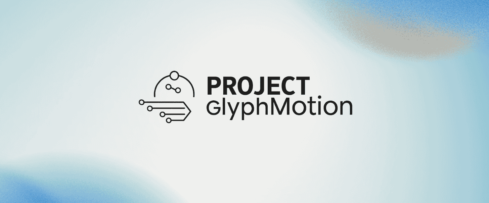

---
# ProjectGlyphMotion 🌀✨

---
Hey there! Welcome to **ProjectGlyphMotion**. This is our personal dive, as two enthusiastic amateurs, into the fascinating world of **real-time object tracking and image segmentation**. We're super excited to be harnessing the power of **Ultralytics YOLOv8 (m)** to make some genuinely cool visual analysis happen.

### ✨ What It's All About

So, what does ProjectGlyphMotion actually *do*? Well, you feed it a video, and it processes that video in real-time, giving you an output that **tracks all the objects** and marks it . This is a personal project from two amateurs exploring computer vision.

---

### 🧪 What We Have Build So Far / What The Project Offers 

- 🌐 [Website](https://projectglyphmotion.studio/)   | [Deployable Website Documentation](https://projectglyphmotion.studio/documentation.html)

- 📜 [Script](https://github.com/ProjectGlyphMotion/Script) | Everything Works Fine 

- 🖥️ [GUI](https://github.com/ProjectGlyphMotion/GUI)  | Currently Archived Because Of [This](https://github.com/ProjectGlyphMotion/Script/commit/506987a03d814ec01e65b76d73a321756638ebed) Issue, It Is Under Fixing And Will Be Fixed (Hopefully/FakeHopes), Other Than That Everything Works Fine  

---

### 💡 Our Journey So Far

This project has been an amazing hands-on learning experience for us. We've tackled everything from setting up the development environment (which, let's be honest, can be a headache sometimes!) to truly understanding the YOLO model and trying to squeeze out the best performance for real-time applications. Every bug and challenge has been a stepping stone, and we're hoping our code can offer a clear path for here anyone else just starting out.

### 🤝 Want to Help Out?

We're always learning, and we'd love your input! If you've got suggestions, spot a bug, or just want to bounce some ideas around, feel free to open an issue or send us a pull request. Every bit of help makes ProjectGlyphMotion better.

---
